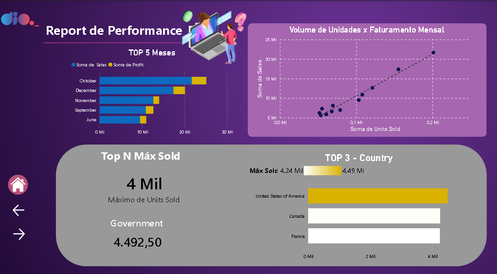
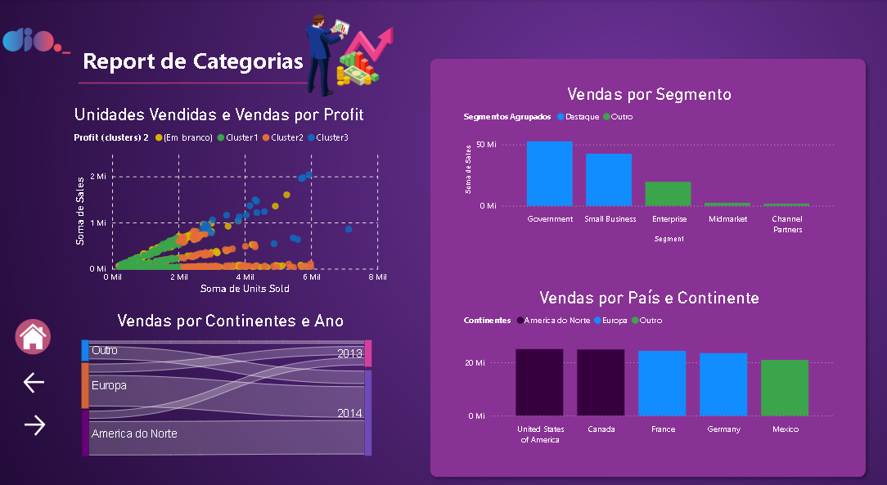
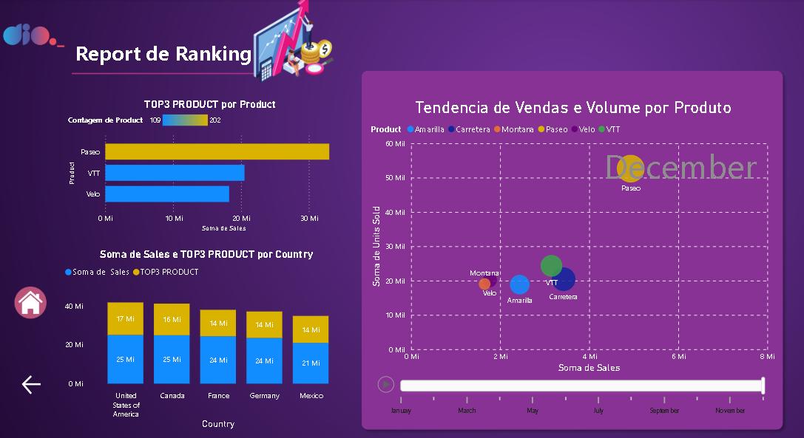
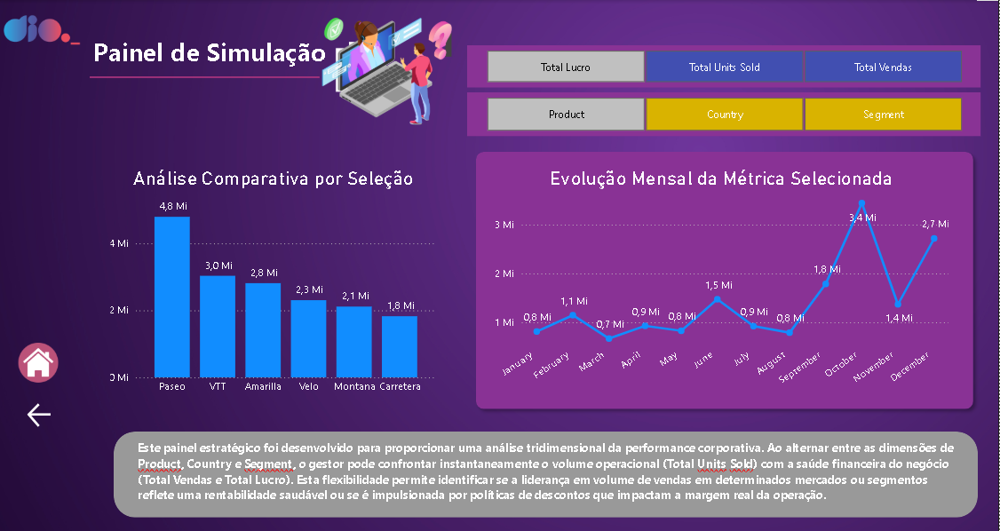

# Projeto de Data Analytics - Dashboard Financeiro com Power BI

## 📌 Sobre o Projeto
Este repositório contém um projeto de portfólio focado na criação de um relatório financeiro interativo e estratégico. O desenvolvimento foi guiado por requisitos técnicos rigorosos, com atenção especial à experiência do usuário (UX), hierarquia visual e storytelling de dados.

## 🎯 Requisitos do Desafio
O dashboard foi construído respeitando as seguintes diretrizes:
*   Estruturação em múltiplas páginas com navegação intuitiva.
*   Criação de medidas DAX para cálculos financeiros complexos (Total de Vendas, Lucro, Unidades, TOP N).
*   Implementação de visuais de agrupamento, compartimentação (Binning) e análise de outliers.
*   Desenvolvimento de uma página de simulação estratégica utilizando **Field Parameters**.

---

## 📊 Estrutura do Relatório

### 1. Home Page
Tela de entrada com identidade visual moderna, contendo o título "Report Financeiro" e botão interativo para iniciar a exploração da análise.

### 2. Sales Report (Principal)
Painel gerencial de alto nível com KPIs resumidos. Utiliza indicadores (Bookmarks) para alternar dinamicamente entre visuais de Barras e Pizza, e entre Treemap e Mapa no mesmo espaço de tela.
.PNG)

### 3. Detalhes (Report de Lucro Detalhado)
Página voltada para o aprofundamento analítico, apresentando o detalhamento em matriz por trimestre e ano, além de um histograma focado na distribuição de unidades vendidas.
.PNG)

### 4. Report de Performance (Data Analytics)
Focado em correlações, exibe a relação entre volume de unidades e faturamento mensal, além de destacar os rankings de TOP 5 meses e TOP 3 países.

### 5. Categorias & Cluster
Utiliza inteligência de dados para agrupamentos automáticos (Clustering) e visuais de fluxo (Sankey Chart) para demonstrar a distribuição de vendas entre continentes e anos.

### 6. Report de Ranking (TOPN & Outliers)
Identificação visual de tendências e exceções através de um gráfico de dispersão dinâmico com **Eixo de Reprodução (Play Axis)** para análise temporal.

### 7. Painel de Simulação Estratégica (Módulo Final)
Esta página foi desenvolvida seguindo as regras de **Storytelling**, proporcionando autonomia total ao usuário final através de parâmetros de campos:
*   **Dimensões Dinâmicas**: Alternância entre Product, Country e Segment.
*   **Métricas On-Demand**: Escolha entre Total Lucro, Total Units Sold e Total Vendas.
*   **Narrativa de Dados**: Container dedicado com insights que guiam o gestor na identificação de distorções entre volume operacional e rentabilidade real.

---

## 🛠️ Tecnologias Utilizadas
*   **Microsoft Power BI**: Desenvolvimento de dashboards e visualização de dados.
*   **DAX (Data Analysis Expressions)**: Criação de medidas e indicadores dinâmicos.
*   **Power Query**: Limpeza, tratamento e modelagem de dados.
*   **UX/UI Design**: Princípios aplicados para garantir legibilidade e fluxo de informação profissional.

---
**Desenvolvido por Diego Floriano Costa**
*Analista de TI e Analista de Dados*
